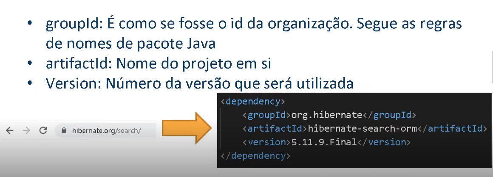

# dio-estudos-java
## Curso de Java pela DIO; projetos e materiais de apoio.


### 📚Material de apoio para Java
- [Java básico](https://glysns.gitbook.io/java-basico/sintaxe/variaveis).
- [Java DOC](https://web.dio.me/course/aprendendo-a-sintaxe-java/learning/22291e9a-f214-4429-9701-3c6e050e2e19?back=/track/santander-2024-backend-com-java&tab=undefined&moduleId=undefined)


### Propriedades
- **Final**:
  _torna a variável imutável_
- **Protected**:
  _limita o aceso da variável às classes filhas que herdam a classe mae_
- **Private**:
    _Apenas a classe pode acessar aquela variável_
- **Default**:
_É usado em variáveis de abstract, não classes normais_


### Ⓜ️Maven
**Estrutura**


#### Comandos:

- _Para transformar aquele projeto em uma dependencia local na pasta .m2_:
````mvn install````
- _Para compilar o arquivo após adicionar uma dependência_: ````mvn compile````


#### Escopos:
- Compile:

*Default / Disponível em todos classpaths / Transitivo*
- Provided: 

*Fornecido por uma implementação que rodará em tempo de execução / Não é transitivo*
- Runtime: 

*necessária apenas para a execução e não compilação*
- Test: 

*Disponível somente para compilação e execução dos testes*
- System: 

*Similar ao provided sendo necessário prover o JAR explicitamente*
- Import:

*Disponível apenas com uma dependência do tipo POM / reutilizar dependencias de outro projeto*

- A tag <_optional_> é usada nas dependências que não se quer que haja transitividade na hora de importar em outras dependecias


#### Maven build lifesycle

* Composto por 3 ciclos de vida
* Cada ciclo possui fases e objetivos

    
  * **Default Lifecycle**
    * principal ciclo
    * responsvaél pelo deploy local
    * composto por 23 fases
  * **Clean Lyfecycle**
    * Faz a limpeza
    * composto por 3 fazes
      * pre-clean
      * clean
      * post-clean
  * **Site Lifecycle**
    * ciclo final
    * criação do site de documentação do projeto
    * 4 fases
      * pre-site
      * sote
      * post-site
      * site-deploy

### JUnit
**Asserts**

_Para comparar números inteiros_

````Assertions.assertEquals()````

_Verificações Booleanas_

````Assertions.assertTrue()````
````Assertions.assertFalse()````

_Comparação de Arrays_

````Assertion.assertArrayEquals()````

_Throws exception_

````Assertions.assertTrows(<Exception>.class, () -> <chamar a função para verificar se ocorre a exception>)````


**Boas práticas**

* Primeiro você faz o teste e depois faz o código
* Crie um código inicial de forma que ele de errado para a partir daí seguir os 3 passos da TDD
* Faça o código retornar o valor certo com a menor quantidade de linhas possíveis
* Refatore o código, arrume
* Os testes devem ser o mais simples possóvel para que todos entendam a documentação do código
* Quando o teste passa sem que você tenha escrito o código especificamente para ele, suspeite


**@**

* @TestMethodOrder(MethodOrder.OrderAnnotation.class)
  * @Order()


### ✨ Extras
**Operador ternário**

_É uma espécie de if resumida:_
```
String resultado = a==b ? "Verdadeiro" "Falso"
```
_A variável resultado vai receber o valor "Verdadeiro" caso a==b, se não receberá "Falso"._

**Operadores lógicos**

_Operador &&, para o caso das 2 condições serem verdadeiras_
```
if (a && b){System.out.println("True");}
```

_Operador ||, para quando pelo menos uma das operações for verdadeira_
```
if (a||b){System.out.println("Pelo menos um é true")}
```

**Como executar arquivos .class usando args no terminal**
- [Terminal e argumentos - Aula 3](https://web.dio.me/course/aprendendo-a-sintaxe-java/learning/1e236fcb-c01a-49ee-bd79-e9a41cde9cff?back=/track/santander-2024-backend-com-java&tab=undefined&moduleId=undefined)


**Material de apoio sobre MongoDB**
- [Site MongoDB](https://www.mongodb.com/blog/post/building-with-patterns-a-summary)
- [Agregation - MongoDB manual](https://www.mongodb.com/blog/post/building-with-patterns-a-summary)

